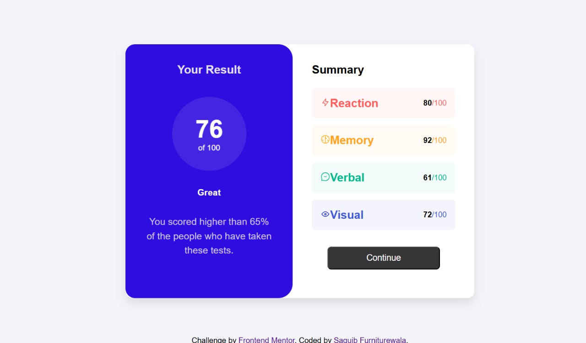

# Frontend Mentor - Results summary component solution

This is a solution to the [Results summary component challenge on Frontend Mentor](https://www.frontendmentor.io/challenges/results-summary-component-CE_K6s0maV). Frontend Mentor challenges help you improve your coding skills by building realistic projects. 

## Overview

### The challenge

In this project, you will create a responsive interface that adapts seamlessly to various screen sizes. Your goal is to enhance user experience and interactivity. Users should be able to:

Responsive Design: View the optimal layout that adjusts dynamically based on the device's screen size, ensuring a consistent and user-friendly experience across all devices (mobile, tablet, and desktop).
Interactive States: Experience clear hover and focus states for all interactive elements, such as buttons and links, enhancing accessibility and usability.

### Screenshot

### Links

- Solution URL: https://github.com/SaquibFurniturewala1/Frontend-Mentor-Results-summary-component.git
- Live Site URL:  https://saquibfurniturewala1.github.io/Frontend-Mentor-Results-summary-component/

## My process

### Built with

- Semantic HTML5 markup
- CSS custom properties
- Flexbox
- Inline CSS

### What I learned

I have gained a deeper understanding of media queries and how they can be used to create responsive web designs

### Continued development

In future projects, I want to continue refining my skills in CSS layout techniques, particularly with Flexbox and Grid. I aim to explore more advanced concepts such as CSS animations and transitions to enhance user interactivity. Additionally, I would like to improve my proficiency in JavaScript to implement dynamic features in my projects. This will help me create more engaging and interactive user experiences as I progress in my front-end development journey.

## Author

- Frontend Mentor - https://www.frontendmentor.io/profile/SaquibFurniturewala1

## Acknowledgments

A special thanks to the Frontend Mentor community for their support and inspiration throughout this project. Their feedback has been invaluable in my learning journey.
